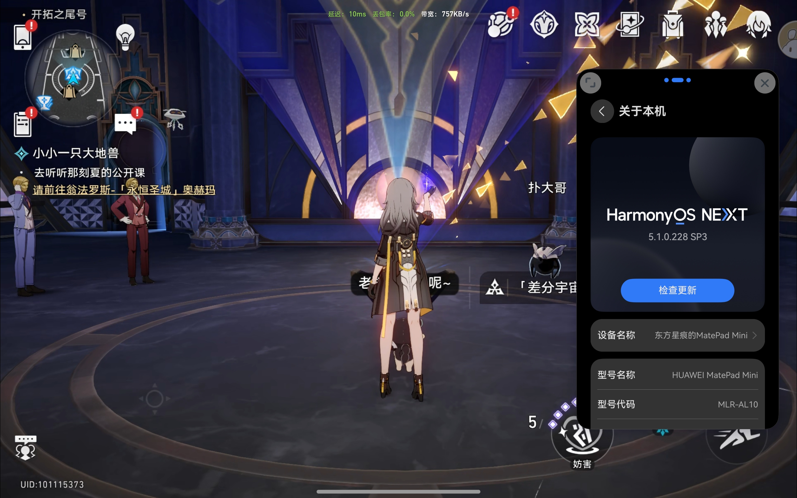

# paimon
鸿蒙5.0和6.0上的米哈游旗下云游戏启动器， 目前支持云原神和云崩坏·星穹铁道

### 支持游戏
- [x] 云原神
- [x] 云崩坏·星穹铁道
- [ ] 云绝区零: 不支持, 因为没有网页版

### 截图

### 安装方法
>自行选择合适的方法，推荐方法1
- 方法1: 下载未签名版本，使用[小白助手](https://github.com/likuai2010/auto-installer)安装
- 方法2: 下载项目自行编译安装

### 实现原理
封装的云游戏网页版本

